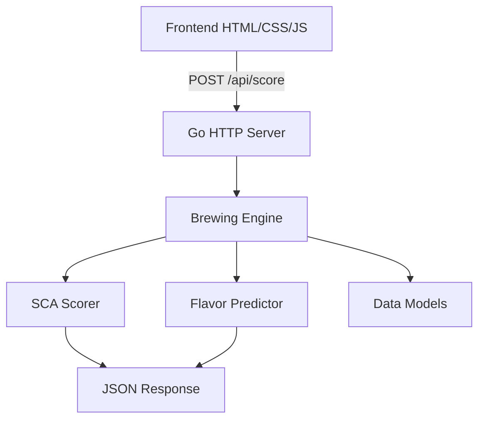

# Technical Blueprint - Celestial Brew

## 1. System Architecture
Aplikasi ini menggunakan arsitektur monolitik ringan dengan pemisahan tanggung jawab yang jelas antara backend (Go) dan frontend (Web).



## 2. Directory Structure
```text
/specialty-coffee-brewer
├── brewer/               # Core Logic (Go Package)
│   ├── engine.go         # Scoring & Flavor Logic
│   ├── models.go         # Struct Definitions
│   └── engine_test.go    # Unit Testing
├── static/               # Frontend Assets
│   ├── index.html        # Main Entry
│   ├── style.css         # Celestial Design System
│   └── app.js            # Frontend Logic, Timer, History
├── main.go               # Server Entry Point
├── go.mod                # Dependency Management
└── server.exe            # Built Binary
```

## 3. Technology Stack
- **Languages**: Go 1.2x+, JavaScript (ES6+), HTML5, CSS3.
- **Backend**: Go Standard Library (`net/http`, `encoding/json`).
- **Frontend**: Vanilla JS (Canvas/CSS Animations untuk celestial theme).
- **Design Patterns**: 
    - *Service Pattern* di backend untuk evaluasi resep.
    - *LocalStorage persistence* untuk riwayat seduhan.

## 4. Flavor Prediction Logic
Logika prediksi rasa didasarkan pada prinsip ekstraksi kopi:
- **Acidity**: Tinggi pada suhu rendah atau waktu seduh singkat (under-extraction).
- **Bitterness**: Tinggi pada suhu tinggi (>95°C) atau waktu seduh terlalu lama (over-extraction).
- **Body**: Dipengaruhi oleh rasio kopi-ke-air dan metode seduh (Espresso memiliki body tertinggi).

## 5. Setup & Development
1. Pastikan Go terinstal.
2. Jalankan perintah: `go run main.go`
3. Buka browser di `http://localhost:8080`.
